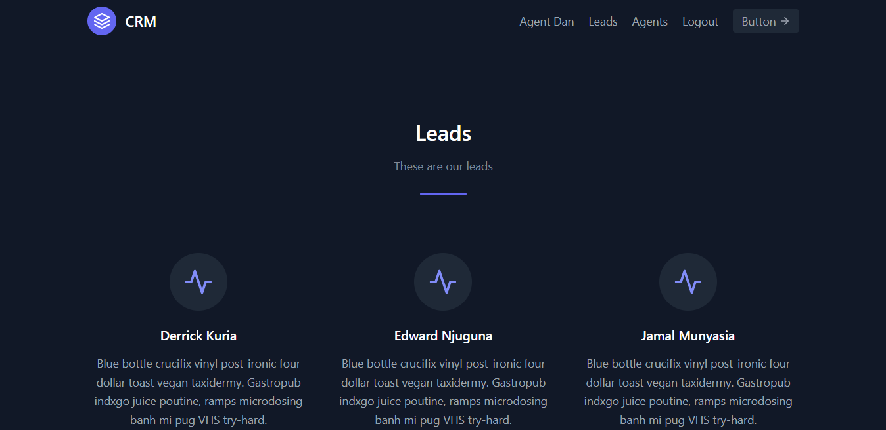

<h1 align="center">DJANGO CRM</h1>
<h3 align="center">Building a Customer Relationship Management system with django</h3>

<h2>What a CRM is ..</h2>

<p>A CRM is a system used by businesses to manage and analyze customer interactions and data. CRM systems can help businesses keep track of customer details such as contact information, purchasing history, and preferences. They can also help businesses manage customer relationships by providing tools for tracking sales and customer service interactions.</p>

<p>This CRM built using Djangp's special features does the work...</p>


<h3 align="center">Features</h3>
<h3>Django Register/ Login/ Logout feature</h3>
<p>-It uses the Django's built in registration feature.
The Django registration feature is a set of tools that helps you manage user accounts on your website. It includes tools for creating and managing user accounts, password recovery, and more.</p>
<p>-One has to Register as a Lead or a member of the company in order to access the Login / Logout features.</p>
<h3>Complete CRUD operations</h3>
<p>CRUD is an acronym for "create, read, update, delete." These four basic functions are the core of many web applications. Uses sqlite as the database</p>
<p>Only the Lead signed in is able to update and delete a member</p>

<h4>Required Modules</h4>

```
Pillow
$pip install Pillow
```
<h2>Cloning and Running this Project</h2>
<h4> <b>1.</b> Clone the repository</h4>

```
$git clone {url of repository}

```

<h4> <b>2.</b> Create a virtual environment</h4>

```
python -m virtualenv {name of virtualenv}

```

<h4> <b>3.</b> Install modules required</h4>

```
$cd CRM
/CRM$pip install -r requirements.txt

```

<h4> <b>4.</b> Runserver</h4>

```
/CRM$python manage.py runserver

```

<h2>Creating a super user and using the admin page</h2>

<h4> <b>1.</b> Makemigrations First</h4>

```
/CRM$python manage.py makemigrations
```

<h4> <b>2.</b> Migrate </h4>

```
/CRM$python manage.py migrate

```
<h4> <b>3.</b> Createsuperuser</h4>

```
/CRM$python manage.py createsuperuser

```

<h4>Powered by: </h4>
<p align="left"> <a href="https://getbootstrap.com" target="_blank" rel="noreferrer">  </a> <a href="https://www.w3schools.com/css/" target="_blank" rel="noreferrer">  </a> <a href="https://www.djangoproject.com/" target="_blank" rel="noreferrer">  </a><a href="https://sass-lang.com" target="_blank" rel="noreferrer">  </a> <a href="https://www.sqlite.org/" target="_blank" rel="noreferrer">  </a> <a href="https://tailwindcss.com/" target="_blank" rel="noreferrer">  </a> </p>

